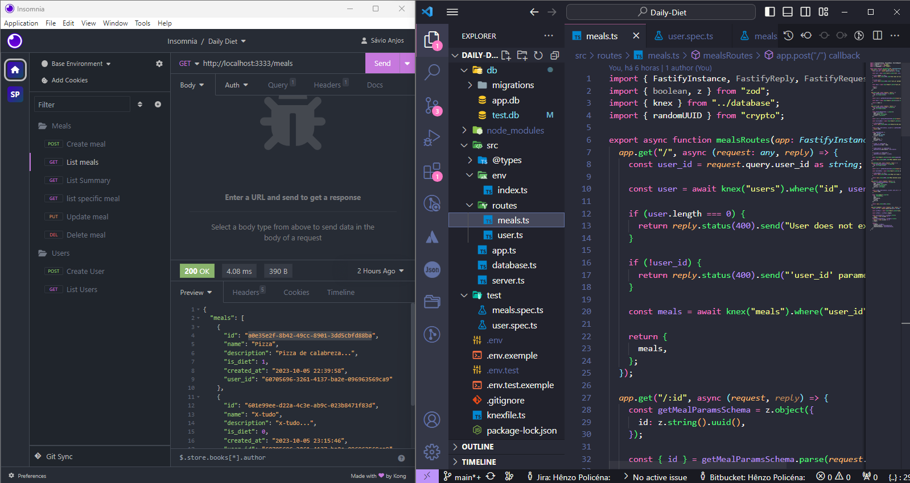

<p align='center'></p>

 <p align='center'>


  
</p>

## 🚀 Tecnologias

Esse projeto está utilizando as seguintes tecnologias:

- [Node](https://nodejs.org/en)
- [TypeScript](https://fastify.dev/)
- [Fastify](https://fastify.dev/)
- [Vitest](https://vitest.dev/)

## 📜 Descrição

Esse projeto é um desafio proposto no curso Ignite da [Rocketseat](https://www.rocketseat.com.br/), o obejetivo foi criar uma API REST para controle de dieta diária.

## ⚙️ Como funciona?

- O usuario deve estar logado para utilizar as funcionalidades;

- O usuário pode registrar uma refeição;
- O usuário pode atualizar uma refeição registrada;
- O usuário pode deletar uma refeção;
- O usuário pode listar as próprias refeições registradas;
- O usuário pode visualizar um resumos das informações cadastradas;
- O usuario recebe as informações se está ou não dentro da dieta;

## 🎲 Quer customizar o projeto?

### Clone esse repositório

```bash
git clone https://github.com/Savio-Anjos/API-Daily-Diet.git
```

### Navegue até o diretório do projeto

```bash
cd API-Daily-Diet
```

### Inicie a aplicação

```bash
npm run dev
```

## 🖼️ Layout



---

<p>Criado com 💙 por <a href='https://github.com/Savio-Anjos/' target='_blank'>Sávio Anjos</a></p>
